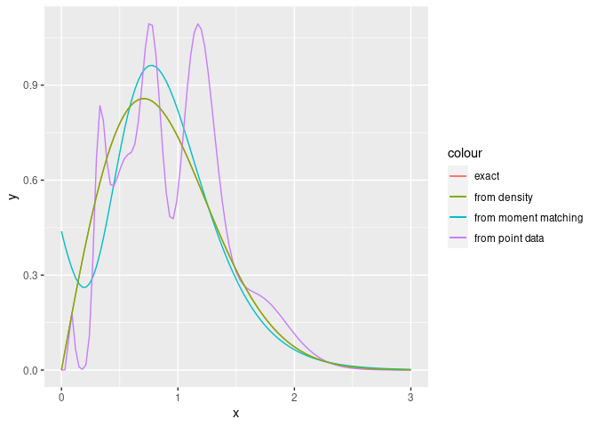

<!-- README.md is generated from README.Rmd. Please edit that file -->

# mapfit

<!-- badges: start -->

[](https://github.com/okamumu/mapfit/actions)
[](https://CRAN.R-project.org/package=mapfit)
[](https://app.codecov.io/gh/okamumu/mapfit?branch=main)
<!-- badges: end -->

The goal of mapfit is to estimate parameters of phase-type distribution
(PH) and Markovian arrival process (MAP). PH/MAP fitting is required in
the analysis of non-Markovian models involving general distributions. By
replacing general distributions with estimated PH/MAP, we have
approximate the non-Markovian models with continuous-time Markov chains
(CTMCs). Our tool offers

-   PH/MAP fitting with grouped data
-   PH fitting with theoretical probability density functions.

These features help us to analyze non-Markovian models with phase
expansion.

## Installation

``` r
# Install devtools from CRAN
install.packages("mapfit")

# Or the development version from GitHub:
# install.packages("devtools")
devtools::install_github("okamumu/mapfit")
```

## PH Fitting

### Overview

PH distribution is defined as the time to absorption in a
time-homogeneous CTMC with an absorbing state. The p.d.f. and cumulative
distribution function (c.d.f.) are mathematically given as the
expressions using matrix exponential. Let

and

denote a probability (row) vector for determining an initial state and
an infinitesimal generator for transient states, respectively. Since the
c.d.f. is given by the probability that the current state of underlying
CTMC has already been absorbed, the c.d.f. of PH distribution is given
by

 = 1 - \boldsymbol{\alpha} \exp(\boldsymbol{Q} x) \boldsymbol{1},
")

where

is a column vector whose entries are 1. Also the p.d.f. can be obtained
by taking the first derivative of the c.d.f.;

 = \boldsymbol{\alpha} \exp(\boldsymbol{Q} x) \boldsymbol{\xi},
")

where
.

The purpose of PH fitting is to determine PH parameters

and

so that the estimated PH distribution fits to observed data. There are
two different approaches; MM (moment match) method and MLE (maximum
likelihood estimation). The MM method is to find PH parameters whose
first few moments match to the moments from empirical data or
distribution functions. On the other hand, MLE is to find PH parameters
maximizing the likelihood (probability) of which the data is drawn from
the model as a sample.

### Data for PH fitting

The parameter estimation algorithm generally depends on data forms to be
used. mapfit deals with several kinds of data in PH fitting; point data,
weighted point data, grouped data, grouped data with missing values and
truncated data. The point data consists of independent and
identically-distributed (IID) random samples.

| Sample No. | Time |
|:----------:|:----:|
|     1      | 10.0 |
|     2      | 1.4  |
|     …      |  …   |
|    100     | 51.0 |

The above table shows an example of point data for a hundred IID
samples. The weighted point data is the point data in which all points
have their own weights. The weighted point data is used for numerical
integration of a density function in our tool. The grouped data consists
of break points and counts. For each of two successive break points, the
number of samples is counted as a bin. This is equivalent to the data
format to draw a histogram.

The grouped data with missing values allows us to use the grouped data
in which several counts are unknown (missing). In the tool, missing
counts are expressed by `NA`. Also, in the truncated data, several
samples are truncated at a point before their observations (right
censored data). The truncated data can be represented as the number of
samples in a specific interval from the point to infinity in the context
of grouped data.

| Time interval | Counts |
|:-------------:|:------:|
|   \[0, 10\]   |   1    |
|  \[10, 20\]   |  `NA`  |
|  \[20, 30\]   |   4    |
|  \[30, 40\]   |   10   |
|  \[40, 50\]   |  `NA`  |
|  \[50, 60\]   |   30   |
|  \[60, 70\]   |   10   |
|  \[70, 80\]   |   12   |
|  \[80, 90\]   |   4    |
|  \[90, 100\]  |   0    |
|  \[100, Inf)  |   5    |

The above table shows an example of the grouped data on break points 0,
10, 20, …, 100 where the data has missing values at the intervals
\[10,20\] and \[40,50\]. Furthermore, the last 5 samples are truncated
at 100.

| Time interval | Counts |
|:-------------:|:------:|
|   \[0, 10\]   |   1    |
|  \[10, 20\]   |  `NA`  |
|  \[20, 30\]   |   4    |
|  \[30, 40\]   |   10   |
|  \[40, 50\]   |  `NA`  |
|  \[50, 60\]   |   30   |
|  \[60, 70\]   |   10   |
|  \[70, 80\]   |   12   |
|  \[80, 90\]   |   4    |
|  \[90, 100\]  |   0    |
|  \[100, Inf)  |  `NA`  |

On the other hand, the aboe table shows an example of another grouped
data. In this case, several samples are truncated at 100 but we do not
know the exact number of truncated samples.

### Models and Methods

PH distributions are classified to sub-classes by the structure of

and
,
and the parameter estimation algorithms depend on the class of PH
distribution. The tool deals with the following classes of PH
distribution:

-   general PH: The PH distribution in which there are no constraints on
    
    and
    .
    In the tool, this is referred to as \`ph’ class.
-   canonical form 1 (CF1): One of the minimal representations of
    acyclic PH distribution. The matrix
    
    becomes a bidiagonal matrix whose entries are sorted in increasing
    order. In the tool, this is referred to as \`cf1’ class.
-   hyper-Erlang distribution: One of the representations of acyclic PH
    distribution. The distribution consists of a mixture of Erlang
    distributions. In the tool, this is referred to as \`herlang’ class.

The parameters of `ph` class are
,

and
,
which are defined as members of R6 class in R. To represent the matrix
,
we use `Matrix` package which is an external package of R. The `cf1`
class are inherited from the `ph` class. In addition to inherited
members, `cf1` has a member `rate` to store the absolute values of
diagonal elements of
.
The `herlang` class has the member for the mixed ratio as `alpha`, shape
parameters of Erlang components `shape`, rate parameters of Erlang
components `rate`. `herlang` classes can be transformed to `ph` class by
using `as.gph` method of R. `cf1` has members for `alpha`, `Q` and `xi`.

The R functions for PH parameter estimation are;

-   `phfit.point`: MLEs for general PH, CF1 and hyper-Erlang
    distribution from point and weighted point data. The estimation
    algorithms for general PH and CF1 are the EM algorithms proposed in
    \[1\]. The algorithm for hyper-Erlang distribution is the EM
    algorithm with shape parameter selection described in \[2,3\].
-   `phfit.group`: MLEs for general PH, CF1 and hyper-Erlang
    distribution from grouped and truncated data. The estimation
    algorithms for general PH and CF1 are the EM algorithms proposed in
    \[4\]. The algorithm for hyper-Erlang distribution is the EM
    algorithm with shape parameter selection, which is originally
    developed as an extension of \[2,3\].
-   `phfit.density`: MLEs for general PH, CF1 and hyper-Erlang
    distribution from a density function defined on the positive domain
    \[0, Inf). The function `phfit.density` calls `phfit.point` after
    making weighted point data. The weighted point data is generated by
    numerical quadrature. In the tool, the numerical quadrature is
    performed with a double exponential (DE) formula.
-   `phfit.3mom`: MM methods for acyclic PH distribution with the first
    three moments \[5,6\].

The functions `phfit.point`, `phfit.group` and `phfit.density` select an
appropriate algorithm depending on the class of a given PH distribution.
These functions return a list including the estimated model (`ph`, `cf1`
or `herlang`), the maximum log-likelihood (llf), Akaike information
criterion (aic) and other statistics of the estimation algorithm. Also,
the function `phfit.3mom` returns a `ph` class whose first three moments
match to the given three moments.

### Example

Here we introduce examples of the usage of PH fitting based on IID
samples from Weibull distribution. At first, we load the mapfit package
and generate IID samples from a Weibull distribution:

``` r
library(mapfit)

RNGkind(kind = "Mersenne-Twister")
set.seed(1234)
wsample <- rweibull(100, shape=2, scale=1)
```

`wsample` is set to a vector including a hundred IID samples generated
from Weibull distribution with scale parameter 1 and shape parameter 2.
`set.seed(1234)` means determing the seed of random numbers.

``` r
wsample
#>   [1] 1.47450394 0.68871906 0.70390766 0.68745901 0.38698715 0.66768398
#>   [7] 2.15798755 1.20774494 0.63744792 0.81550201 0.60487388 0.77911210
#>  [13] 1.12394405 0.28223484 1.10901777 0.42140013 1.11847354 1.14942511
#>  [19] 1.29542664 1.20832306 1.07241633 1.09317655 1.35593576 1.79415102
#>  [25] 1.23272029 0.45823831 0.80189104 0.29867185 0.42977942 1.75616647
#>  [31] 0.88603717 1.15209430 1.09019210 0.82379560 1.30718279 0.52428076
#>  [37] 1.26618210 1.16260990 0.08877248 0.46259605 0.76928163 0.66055079
#>  [43] 1.07949774 0.68927927 1.05326127 0.83015673 0.62445527 0.85066119
#>  [49] 1.18780419 0.51698994 1.61451826 1.08267929 0.57645512 0.82710123
#>  [55] 1.37015479 0.82783512 0.83982074 0.53486736 1.32097400 0.40547750
#>  [61] 0.38107465 1.78142911 1.07157783 2.07043978 1.19632106 0.58944015
#>  [67] 1.08505663 0.82231170 1.72143270 0.75610263 1.45189672 0.33667780
#>  [73] 2.05544853 0.49443698 1.55189411 0.80962054 0.97796650 1.63049390
#>  [79] 1.06650011 0.63460678 0.27649350 0.86658386 1.39556590 0.77994249
#>  [85] 1.27622488 0.32701528 0.97102624 1.08091533 1.35366256 0.33107018
#>  [91] 1.33917815 0.32386549 1.41750912 1.42403682 1.50035348 0.81868450
#>  [97] 1.09695465 1.90327589 1.08273771 0.54611792
```

Based on the point data, we can estimate PH parameters. Here we obtain
the estimated parameters for general PH with 5 states, CF1 with 5 states
and the hyper-Erlang with 5 states by the following commands,
respectively;

``` r
## phfit with GPH
phfit.point(ph=ph(5), x=wsample)
#> 
#> Maximum LLF: -59.436999
#> DF: 16
#> AIC: 150.873999
#> Iteration:  2000 / 2000
#> Computation time (user): 5.436000
#> Convergence: FALSE
#> Error (abs): 2.658413e-05 (tolerance Inf)
#> Error (rel): 4.472655e-07 (tolerance 1.490116e-08)
#> 
#> Size : 5
#> Initial :  8.381857e-11 0.9958299 0.000605489 0.003564639 1.026552e-94 
#> Exit    :  0.1181382 4.427337e-93 6.467791e-06 0.05122773 4.831366 
#> Infinitesimal generator : 
#> 5 x 5 sparse Matrix of class "dgCMatrix"
#>                                                                           
#> [1,] -4.871478e+00  5.176939e-144   1.738194e-66  5.793350e-18  4.75334026
#> [2,]  6.288755e-02  -4.830630e+00   4.592414e+00  8.770330e-03  0.16655846
#> [3,]  1.237500e-04   9.821536e-18  -4.850766e+00  4.816661e+00  0.03397468
#> [4,]  4.455372e+00   3.303485e-66   8.839500e-21 -4.846094e+00  0.33949432
#> [5,]  4.440043e-15  4.269800e-225  4.149348e-124  9.632575e-51 -4.83136581

## phfit with CF1
phfit.point(ph=cf1(5), x=wsample)
#> Initializing CF1 ...
#> oxxxxx
#> xxxxxx
#> xxxxxx
#> xxxxxx
#> xxxxxx
#> xxxxxx
#> 
#> Maximum LLF: -59.416058
#> DF: 8
#> AIC: 134.832116
#> Iteration:  2000 / 2000
#> Computation time (user): 5.334000
#> Convergence: FALSE
#> Error (abs): 1.497201e-06 (tolerance Inf)
#> Error (rel): 2.519859e-08 (tolerance 1.490116e-08)
#> 
#> Size : 5
#> Initial :  0.8888711 0.003245776 0.08347344 0.02440971 9.387039e-102 
#> Rate    :  4.830947 4.830966 4.88052 4.880523 4.880526

## phfit with Hyper-Erlang
phfit.point(ph=herlang(5), x=wsample, herlang.ubound=3)
#> shape:  1 1 3  llf=-62.78
#> shape:  1 2 2  llf=-71.80
#> shape:  1 4  llf=-60.08
#> shape:  2 3  llf=-62.78
#> shape:  5  llf=-61.37
#> 
#> Maximum LLF: -60.083944
#> DF: 5
#> AIC: 130.167889
#> Iteration:  210 / 2000
#> Computation time (user): 0.007000
#> Convergence: TRUE
#> Error (abs): 8.796675e-07 (tolerance Inf)
#> Error (rel): 1.464064e-08 (tolerance 1.490116e-08)
#> 
#> Size : 2
#> Shape   :  1 4 
#> Initial :  0.01005839 0.9899416 
#> Rate    :  3.800021 4.05838
```

In the above example, the number of Erlang components is restructured to
3 or less by using `ubound` argument (see \[2\] in detail).

Also we present PH fitting with grouped data. In this example, we make
grouped data from the point data `wsample` by using the function `hist`
which is originally a function to draw a histogram.

``` r
h.res <- hist(wsample, breaks="fd", plot=FALSE)

h.res$breaks
#>  [1] 0.0 0.2 0.4 0.6 0.8 1.0 1.2 1.4 1.6 1.8 2.0 2.2

h.res$counts
#>  [1]  1  9 12 14 15 20 13  6  6  1  3
```

In the above, breaks are determined according to Freedman-Diaconis (FD)
rule. Then we can get estimated PH parameters from grouped data.

``` r
## phfit with GPH
phfit.group(ph=ph(5), counts=h.res$counts, breaks=h.res$breaks)
#> 
#> Maximum LLF: -22.825543
#> DF: 15
#> AIC: 75.651086
#> Iteration:  2000 / 2000
#> Computation time (user): 1.508000
#> Convergence: FALSE
#> Error (abs): 8.330036e-05 (tolerance Inf)
#> Error (rel): 3.649423e-06 (tolerance 1.490116e-08)
#> 
#> Size : 5
#> Initial :  2.266058e-23 0.01529073 0.9844429 9.839324e-80 0.0002663229 
#> Exit    :  0.05706242 0.0002261988 1.773442e-81 4.885055 2.001724e-15 
#> Infinitesimal generator : 
#> 5 x 5 sparse Matrix of class "dgCMatrix"
#>                                                                           
#> [1,] -4.857445e+00  7.057343e-28  4.419088e-190  4.80038276   1.641968e-94
#> [2,]  4.703377e+00 -4.725863e+00   4.000442e-89  0.02226067   2.489970e-29
#> [3,]  4.169352e-01  8.864945e-04  -4.841568e+00  0.03138550   4.392361e+00
#> [4,]  2.020233e-12  1.872434e-57  9.115024e-259 -4.88505481  3.736393e-145
#> [5,]  1.953170e-07  4.642401e+00   8.048331e-26  0.08537504  -4.727776e+00

## phfit with CF1
phfit.group(ph=cf1(5), counts=h.res$counts, breaks=h.res$breaks)
#> Initializing CF1 ...
#> oxxxxx
#> xxxxxx
#> xxxxxx
#> xxxxxx
#> xxxxxx
#> xxxxxx
#> 
#> Maximum LLF: -22.811905
#> DF: 8
#> AIC: 61.623811
#> Iteration:  1300 / 2000
#> Computation time (user): 0.823000
#> Convergence: TRUE
#> Error (abs): 3.388332e-07 (tolerance Inf)
#> Error (rel): 1.485335e-08 (tolerance 1.490116e-08)
#> 
#> Size : 5
#> Initial :  0.8667713 2.82726e-05 0.1323529 0.0008475288 9.382448e-58 
#> Rate    :  4.684116 4.684117 4.886013 4.886015 4.886017

## phfit with Hyper-Erlang
phfit.group(ph=herlang(5), counts=h.res$counts, breaks=h.res$breaks)
#> shape:  1 1 1 1 1  llf=-61.14
#> shape:  1 1 1 2  llf=-35.55
#> shape:  1 1 3  llf=-26.45
#> shape:  1 2 2  llf=-35.55
#> shape:  1 4  llf=-23.59
#> shape:  2 3  llf=-26.45
#> shape:  5  llf=-23.97
#> 
#> Maximum LLF: -23.588309
#> DF: 5
#> AIC: 57.176618
#> Iteration:  209 / 2000
#> Computation time (user): 0.007000
#> Convergence: TRUE
#> Error (abs): 3.474717e-07 (tolerance Inf)
#> Error (rel): 1.473067e-08 (tolerance 1.490116e-08)
#> 
#> Size : 2
#> Shape   :  1 4 
#> Initial :  0.002267521 0.9977325 
#> Rate    :  3.185773 4.05926
```

Next we present the case where PH parameters are estimated from a
density function. The density function of Weibull distribution is given
by a function `dweibull`. Then we can also execute the following
commands;

``` r
## phfit with GPH
phfit.density(ph=ph(5), f=dweibull, shape=2, scale=1)
#> 
#> Maximum LLF: -11.249196
#> DF: 19
#> KL: 0.002153
#> Iteration:  2000 / 2000
#> Computation time (user): 5.034000
#> Convergence: FALSE
#> Error (abs): 3.226234e-06 (tolerance Inf)
#> Error (rel): 2.867968e-07 (tolerance 1.490116e-08)
#> 
#> Size : 5
#> Initial :  0.000304328 0.03337799 0.9405495 2.616356e-41 0.02576815 
#> Exit    :  0.07945586 0.002737312 1.511001e-40 5.005428 0.000157915 
#> Infinitesimal generator : 
#> 5 x 5 sparse Matrix of class "dgCMatrix"
#>                                                                          
#> [1,] -4.931006e+00  4.390600e+00   1.876011e-12  0.32654057  1.344095e-01
#> [2,]  2.357587e-08 -4.928534e+00   6.597754e-29  0.05162549  4.874172e+00
#> [3,]  4.367438e+00  3.851378e-02  -4.963326e+00  0.31719188  2.401815e-01
#> [4,]  5.201979e-58  4.258016e-30  2.749470e-103 -5.00542847  9.155848e-11
#> [5,]  5.975818e-25  8.264235e-08   1.224404e-56  4.96138220 -4.961540e+00

## phfit with CF1
phfit.density(ph=cf1(5), f=dweibull, shape=2, scale=1)
#> Initializing CF1 ...
#> oxxxxx
#> xxxxxx
#> xxxxxx
#> xxxxxx
#> xxxxxx
#> xxxxxx
#> 
#> Maximum LLF: -11.247613
#> DF: 8
#> KL: 0.002069
#> Iteration:  2000 / 2000
#> Computation time (user): 4.905000
#> Convergence: FALSE
#> Error (abs): 2.767693e-07 (tolerance Inf)
#> Error (rel): 2.460694e-08 (tolerance 1.490116e-08)
#> 
#> Size : 5
#> Initial :  0.7536251 0.002987832 0.1516952 0.09169184 2.131364e-37 
#> Rate    :  4.844488 4.844509 5.062465 5.06247 5.062475

## phfit with Hyper-Erlang
phfit.density(ph=herlang(5), f=dweibull, shape=2, scale=1)
#> shape:  1 1 1 1 1  llf=-16.55
#> shape:  1 1 1 2  llf=-12.44
#> shape:  1 1 3  llf=-11.48
#> shape:  1 2 2  llf=-12.44
#> shape:  1 4  llf=-11.39
#> shape:  2 3  llf=-11.51
#> shape:  5  llf=-12.83
#> 
#> Maximum LLF: -11.391140
#> DF: 5
#> KL: 0.009694
#> Iteration:  80 / 2000
#> Computation time (user): 0.008000
#> Convergence: TRUE
#> Error (abs): 1.468694e-07 (tolerance Inf)
#> Error (rel): 1.289330e-08 (tolerance 1.490116e-08)
#> 
#> Size : 2
#> Shape   :  1 4 
#> Initial :  0.07425981 0.9257402 
#> Rate    :  2.132536 4.349237
```

The last two arguments for each execution are parameters of `dweibull`
function. User-defined functions are also used as density functions in
similar manner.

Usually, the PH fitting with density is used for the PH expansion (PH
approximation) in which known general desitributions are replaced with
the PH distributions estimated from these density functions. Compared to
PH fitting with samples, PH fitting with density function tends to be
accurate, because density function has more information than samples.
Therefore, in the case of PH fitting with density function, we can treat
PH distributions with high orders without causing overfitting, i.e., it
is possible to perform PH fitting even if PH has 100 states;

``` r
## estimate PH parameters from the density function
(result.density <- phfit.density(ph=cf1(100), f=dweibull, shape=2, scale=1))
#> Initializing CF1 ...
#> ooooxx
#> xxxxox
#> xxoxxx
#> xxoxxx
#> xxxxxx
#> xxxxxx
#> 
#> Maximum LLF: -11.208676
#> DF: 199
#> KL: 0.000000
#> Iteration:  40 / 2000
#> Computation time (user): 0.776000
#> Convergence: TRUE
#> Error (abs): 1.596614e-07 (tolerance Inf)
#> Error (rel): 1.424445e-08 (tolerance 1.490116e-08)
#> 
#> Size : 100
#> Initial :  0.0001817557 0.0002199945 0.0002849414 0.0003823432 0.0005203138 0.0007081901 0.0009555305 0.001271161 0.001662378 0.00213446 0.002690543 0.003331824 0.004057922 0.004867224 0.005757032 0.006723475 0.007761197 0.008862959 0.01001928 0.01121831 0.01244589 0.01368604 0.01492163 0.01613516 0.01730967 0.01842943 0.01948053 0.02045124 0.02133205 0.0221157 0.02279694 0.02337235 0.02384012 0.02419988 0.02445255 0.02460023 0.02464612 0.02459445 0.02445036 0.02421979 0.02390929 0.02352592 0.02307703 0.02257007 0.02201249 0.02141157 0.0207743 0.02010733 0.01941691 0.01870884 0.01798851 0.01726081 0.01653022 0.01580077 0.01507609 0.01435938 0.01365348 0.01296082 0.01228352 0.01162334 0.01098173 0.01035988 0.009758688 0.009178828 0.00862076 0.008084756 0.007570922 0.007079222 0.006609496 0.006161481 0.005734828 0.005329111 0.004943847 0.004578498 0.004232485 0.00390519 0.003595963 0.003304128 0.003028987 0.002769832 0.002525954 0.002296659 0.002081281 0.001879196 0.001689827 0.001512641 0.00134713 0.001192767 0.001048963 0.0009150229 0.0007901335 0.0006734343 0.0005642032 0.0004621629 0.0003677834 0.0002822111 0.0002060518 0.0001355869 5.772149e-05 9.89152e-07 
#> Rate    :  12.48094 13.67933 14.7307 15.64476 16.4295 17.09579 17.65842 18.13518 18.54521 18.90725 19.23834 19.55306 19.86316 20.17759 20.50277 20.84294 21.20065 21.57721 21.97308 22.38825 22.82253 23.2757 23.74767 24.23853 24.74852 25.27808 25.82772 26.39805 26.98969 27.60327 28.23941 28.89869 29.58167 30.28889 31.0209 31.77823 32.56147 33.37118 34.20799 35.07256 35.96555 36.8877 37.83973 38.82243 39.83658 40.883 41.96254 43.07605 44.22444 45.40861 46.62951 47.8881 49.18539 50.5224 51.9002 53.31989 54.78258 56.28945 57.84169 59.44054 61.08725 62.78316 64.52958 66.32792 68.17958 70.08605 72.04881 74.06944 76.14951 78.29068 80.49462 82.76309 85.09788 87.50081 89.97379 92.51877 95.13775 97.83278 100.606 103.4596 106.3957 109.4168 112.5251 115.7231 119.0133 122.3984 125.8809 129.4637 133.1495 136.9412 140.8417 144.854 148.9813 153.2266 157.5935 162.0854 166.7062 171.4588 176.3446 181.3698
```

The result provides a highly-accurate approximation for Weibull
distribution. However, from the viewpoint of computation time, it should
be noted that only `cf1` or `herlang` with lower/upper bounds of Erlang
components can be applied to PH fitting with high orders. In the above
example, although the number of states is 100, the execution time is in
a few seconds because of the refinement of EM algorithm \[1\].

If we use only point data to estimate PH paramters with high orders, the
overfitting is happen.

``` r
## estimate PH parameters from 100 samples (overfitting example)
(result.point <- phfit.point(ph=cf1(100), x=wsample))
#> Initializing CF1 ...
#> oooxxx
#> xxxxxx
#> xxxxxx
#> xxxxxx
#> xxxxxx
#> xxxxxx
#> 
#> Maximum LLF: -50.504606
#> DF: 135
#> AIC: 371.009213
#> Iteration:  2000 / 2000
#> Computation time (user): 28.596000
#> Convergence: FALSE
#> Error (abs): 2.196319e-05 (tolerance Inf)
#> Error (rel): 4.348748e-07 (tolerance 1.490116e-08)
#> 
#> Size : 100
#> Initial :  0.1202048 6.679923e-05 9.145549e-07 6.718388e-06 0.001283871 0.02800786 0.01171954 0.008940903 0.315099 0.02227029 9.221007e-08 1.84297e-19 3.756857e-38 3.874537e-62 9.20175e-87 6.878353e-105 2.853375e-109 1.005652e-96 4.503625e-71 2.928074e-41 9.505794e-17 0.00179272 0.2276657 0.001248857 6.610175e-08 7.619455e-13 3.954642e-17 9.383904e-20 3.348167e-20 1.573251e-18 1.97383e-15 1.610638e-11 1.036936e-07 0.0001142191 0.009129112 0.04846457 0.0305252 0.005057544 0.0005268339 7.985494e-05 3.378966e-05 5.432951e-05 0.0002907046 0.00286521 0.01997708 0.03347203 0.005724726 6.916916e-05 9.08789e-08 5.294994e-11 1.25534e-13 1.402524e-14 4.047361e-13 2.399657e-09 0.0001240435 0.09399483 0.001188389 1.702627e-12 2.27337e-31 2.12508e-63 1.579558e-111 1.528505e-178 4.946943e-267 4.940656e-324 4.940656e-324 0 0 0 0 0 0 0 0 0 0 0 0 0 0 0 0 0 3.800888e-310 2.98257e-133 1.016015e-28 0.01 2.112341e-52 1.324818e-170 4.940656e-324 0 0 0 0 0 0 0 0 0 0 0 
#> Rate    :  13.72962 13.72962 13.72963 13.72963 13.77239 14.08349 14.08361 14.08422 33.20377 33.20423 33.20469 33.20493 33.20497 33.20527 33.20535 33.20586 33.20637 33.69793 34.45626 35.48529 37.38158 51.33875 68.41158 68.4116 68.41161 68.41167 68.4117 68.4118 68.41188 68.41188 68.41188 68.49642 68.65949 69.16467 71.61702 74.8835 75.04758 75.04761 75.04777 75.11004 75.2494 75.4362 75.7301 76.4299 78.24315 79.50126 79.5141 79.67761 79.90004 80.1526 80.4383 80.77559 81.2235 82.03581 85.49975 115.0783 115.0783 115.0784 115.0785 115.4152 115.809 116.232 116.6771 117.1402 117.6191 118.112 118.6178 119.1356 119.6647 120.2044 120.7543 121.3138 121.8827 122.4606 123.0475 123.6434 124.2487 124.8639 125.4901 126.1293 126.7854 127.4669 128.1977 129.0762 131.115 165.2486 165.3993 165.6066 165.8337 166.0713 166.3163 166.5671 166.823 167.0835 167.3481 167.6166 167.8888 168.1646 168.444 168.727

library(ggplot2)
ggplot(data.frame(x=seq(0, 3, length.out=100)), aes(x=x)) +
  stat_function(fun=dweibull, args=list(shape=2, scale=1), aes_(colour='exact')) +
  stat_function(fun=dphase, args=list(ph=result.point$model), aes_(colour='from point data')) +
  stat_function(fun=dphase, args=list(ph=result.density$model), aes_(colour='from density'))
```



### References

-   \[1\] H. Okamura, T. Dohi and K.S. Trivedi, A refined EM algorithm
    for PH distributions, Performance Evaluation, 68(10), 938-954, 2011.
-   \[2\] A. Thummler and P. Buchholz and M. Telek, A novel approach for
    phase-type fitting with the EM algorithm, IEEE Transactions on
    Dependable and Secure Computing, 3(3), 245-258, 2006.
-   \[3\] A. Panchenko and A. Thummler, Efficient phase-type fitting
    with aggregated traffic traces, Performance Evaluation, 64, 629-645,
    2007.
-   \[4\] H. Okamura, T. Dohi and K.S. Trivedi, Improvement of EM
    algorithm for phase-type distributions with grouped and truncated
    data, Applied Stochastic Models in Business and Industry, 29(2),
    141-156, 2013.
-   \[5\] A. Bobbio and A. Horvath and M. Telek, Matching three moments
    with minimal acyclic phase type distributions, Stochastic Models,
    21(2/3), 303-326, 2005.
-   \[6\] T. Osogami and M. Harchol-Balter, Closed form solutions for
    mapping general distributions to minimal PH distributions,
    Performance Evaluation, 63(6), 524-552, 2006.

<!-- ## MAP Fitting -->
<!-- ### Overview -->
<!-- MAP (Markovian arrival process) is a stochastic point process whose arrival rates are dominated by a CTMC. The CTMC expresses the internal state of MAP called a phase process. MAP is generally defined by an initial probability vector $\boldsymbol{\alpha}$ and two matrices for infinitesimal generators $\boldsymbol{D}_0$, $\boldsymbol{D}_1$. Let $\boldsymbol{\pi}(n,t)$ be the row vector whose i-th entry is the probability that the phase process is i at time t and n arrivals occur before time t. Then we have the following differential equations: -->
<!-- $$ -->
<!-- \frac{d}{dt} \boldsymbol{\pi}(n,t) = \boldsymbol{\pi}(n,t) \boldsymbol{D}_0 + \boldsymbol{\pi}(n-1,t) \boldsymbol{D}_1, \quad \text{for $n = 1, 2, \ldots$}, -->
<!-- $$ -->
<!-- $$ -->
<!-- \frac{d}{dt} \boldsymbol{\pi}(0,t) = \boldsymbol{\pi}(0,t) \boldsymbol{D}_0, \quad \boldsymbol{\pi}(0,0) = \boldsymbol{\alpha}, -->
<!-- $$ -->
<!-- where $\boldsymbol{D}_0$ and $\boldsymbol{D}_1$ are infinitesimal generators of phase process without and with arrivals, respectively. Note that $\boldsymbol{D}_0 + \boldsymbol{D}_1$ becomes the infinitesimal generator of phase process. Similar to PH fitting, the purpose of MAP fitting is to find MAP parameters $\boldsymbol{\alpha}$, $\boldsymbol{D}_0$ and $\boldsymbol{D}_1$ so that the estimated MAP fits to observed data. In MAP fitting, there are also two approaches; MM method and MLE. The MM method for MAP is to determine MAP parameters with marginal/joint moments and k-lag correlation [1]. MLE is to find MAP parameters maximizing the log-likelihood function. We implement MLE approaches in the tool. -->
<!-- ### Data for MAP fitting -->
<!-- mapfit deals with point data and grouped data in MAP fitting. The point data for MAP fitting is a time series for arrivals. The grouped data for MAP fitting consists of break points and counts which are made from a time series for arrivals. -->
<!-- |Arrival No.|Time (sec)| -->
<!-- |:-:|:-:| -->
<!-- |1 | 1.340 | -->
<!-- |2 | 1.508 | -->
<!-- |3 | 4.176 | -->
<!-- |4 | 8.140 | -->
<!-- |5 | 11.036| -->
<!-- |6 | 15.072 | -->
<!-- |7 | 17.892 | -->
<!-- |8 | 20.604 | -->
<!-- |9 | 22.032 | -->
<!-- |10 | 24.300 | -->
<!-- |... | ... | -->
<!-- The above table shows an example of point data that consists of arrival times. -->
<!-- |Time interval | Counts | -->
<!-- |:-:|:-:| -->
<!-- |[0, 5]| 3 | -->
<!-- |[5, 10]| 1 | -->
<!-- |[10, 15]| 1 | -->
<!-- |[15, 20]| 2 | -->
<!-- |[20, 25]| 4 | -->
<!-- |...|...| -->
<!-- The above table shows an example of grouped data. The grouped data is made from the point data by counting the number of arrivals in every 5 seconds. Note that missing values cannot be treated in MAP fitting of this version of tool. -->
<!-- ### Models and Methods -->
<!-- mapfit has three classes (models) for MAP, which have different parameter estimation algorithms. -->
<!-- - general MAP: MAP with no constraint on parameters. This class is referred to as `map` in the tool. Also, the tool uses a Markov modulated Poisson process (MMPP) as a specific structure of `map`, which can be generated by an `mmpp` command. -->
<!-- - HMM (hidden Markov model) with Erlang outputs (ER-HMM): One of MAP representation where Erlang outputs correspond to time intervals between two successive arrivals [2]. In the tool, this class is referred to as `erhmm`. -->
<!-- - MMPP with grouped data: MMPP with approximate parameter estimation. This is referred to as `gmmpp` in the tool, and is essentially same as `mmpp` except for parameter estimation algorithm. In the parameter estimation of `gmmpp`, it is assumed that at most one phase change is allowed in one observed time interval [3]. -->
<!-- The `map` class consists of parameters $\alpha$, $D_0$ and $D_1$, which are given by slots of S4 class in R. The `gmmpp` class also has the slots `alpha`, `D0` and `D1` as model parameters. The `erhmm` class has an initial probability vector for HMM states (`alpha`), a probability transition matrix for HMM states (`P`), the shape parameters for Erlang distribution (`shape`) and the rate parameters for Erlang distribution (`rate`). The S4 class `erhmm` can be transformed to `map` by using `as` method. -->
<!-- The tool has the follwoing MAP fitting functions: -->
<!-- - `mapfit.point`: MLEs for general MAP and ER-HMM from point data. The estimation algorithm for general MAP is the EM algorithm introduced in [4]. The algorithm for ER-HMM is the EM algorithm proposed in [2]. -->
<!-- - `mapfit.group`: MLEs for general MAP and `gmmpp` from grouped data. Both the estimation algorithms for general MAP and `gmmpp` are presented in [3]. Note that `erhmm` cannot be used in the case of grouped data. -->
<!-- The functions `mapfit.point` and `mapfit.group` select an appropriate algorithm depending on the class of a given MAP. These functions return a list including the estimated model (`map`, `erhmm` or `gmmpp`), the maximum log-likelihood (llf), Akaike information criterion (aic) and other statistics of the estimation algorithm. In general, `erhmm` for point data and `gmmpp` for grouped data are much faster than general MAP. -->
<!-- ### Example -->
<!-- Here we demonstrate MAP fitting with point and grouped data. The data used in this example is the traffic data; BCpAug89, which consists of time intervals for packet arrivals and is frequently used in several papers as a benchmark. We use only the first 1000 arrival times. -->
<!-- ```{r bcpaug89} -->
<!-- data(BCpAug89) -->
<!-- BCpAug89 -->
<!-- ``` -->
<!-- Using this point data, we can estimate parameters for general MAP with 5 states, MMPP with 5 states and ER-HMM with 5 states by the following commands, respectively; -->
<!-- ```{r mapfitpint1} -->
<!-- ## mapfit for general MAP -->
<!-- mapfit.point(map=map(5), x=cumsum(BCpAug89)) -->
<!-- ## mapfit for general MMPP -->
<!-- mapfit.point(map=mmpp(5), x=cumsum(BCpAug89)) -->
<!-- ## mapfit for ER-HMM -->
<!-- mapfit.point(map=erhmm(5), x=cumsum(BCpAug89)) -->
<!-- ``` -->
<!-- In the above example, `cumsum` is a function to derive cumulative sums because `BCpAug89` provides time difference data. The estimation with `erhmm` is much faster than others. -->
<!-- Next we present MAP fitting with grouped data. The grouped data is made from `BCpAug89` by using `hist` function, i.e., -->
<!-- ```{r genmapgroup} -->
<!-- BCpAug89.group<-hist(cumsum(BCpAug89), breaks=seq(0,2.7,0.01), plot=FALSE) -->
<!-- BCpAug89.group$breaks -->
<!-- BCpAug89.group$counts -->
<!-- ``` -->
<!-- In the above, break points are set as a time point sequence from 0 to 2.7 by 0.01, which is generated by a `seq` function. Using the grouped data, we have the estimated parameters for general MAP, MMPP and MMPP with approximate estimation (`gmmpp`). -->
<!-- ```{r mapfitall} -->
<!-- ## mapfit for general MAP with grouped data -->
<!-- mapfit.group(map=map(5), counts=BCpAug89.group$counts, breaks=BCpAug89.group$breaks) -->
<!-- ## mapfit for general MMPP with grouped data -->
<!-- mapfit.group(map=mmpp(5), counts=BCpAug89.group$counts, breaks=BCpAug89.group$breaks) -->
<!-- ## mapfit for general MMPP with grouped data (approximation) -->
<!-- mapfit.group(map=gmmpp(5), counts=BCpAug89.group$counts, breaks=BCpAug89.group$breaks) -->
<!-- ``` -->
<!-- ### References -->
<!-- - [1] G. Horvath, P. Buchholz and M. Telek, A MAP fitting approach with independent approximation of the inter-arrival time distribution and the lag correlation, Proceedings of the 2nd International Conference on the Quantitative Evaluation of Systems (QEST2005), 124-133, 2005. -->
<!-- - [2] H. Okamura and T. Dohi, Faster maximum likelihood estimation algorithms for Markovian arrival processes, Proceedings of 6th International Conference on Quantitative Evaluation of Systems (QEST2009), 73-82, 2009. -->
<!-- - [3] H. Okamura, T. Dohi and K.S. Trivedi, Markovian arrival process parameter estimation with group data, IEEE/ACM Transactions on Networking, 17(4), 1326-1339, 2009. -->
